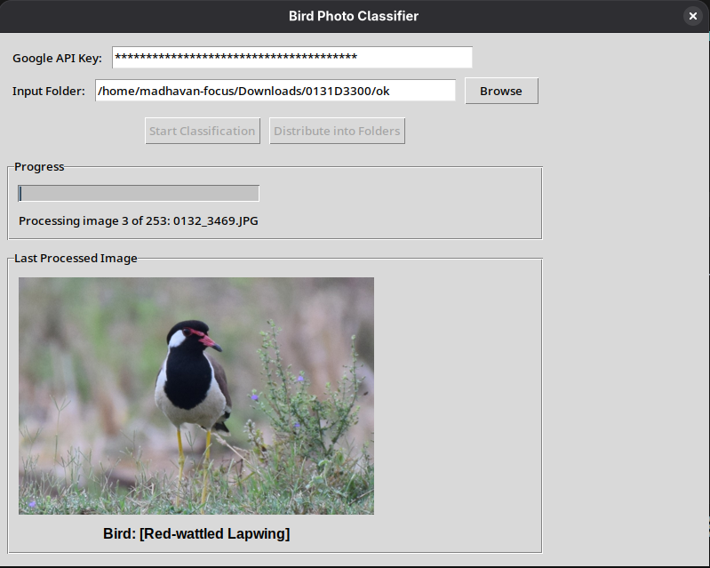

# Bird Photo Organizer

This script uses Google's Gemini AI to identify birds in photos and organize them into folders based on bird species.



Useful for Bird photographers
## Dev 
```
pip install -r requirements.txt
python main.py
```

You will need an Google Gemini API key, you can [create an API Key here](https://aistudio.google.com/apikey).

## Distribute
```
python build.py
```

Dist files will be created in `dist/` directory